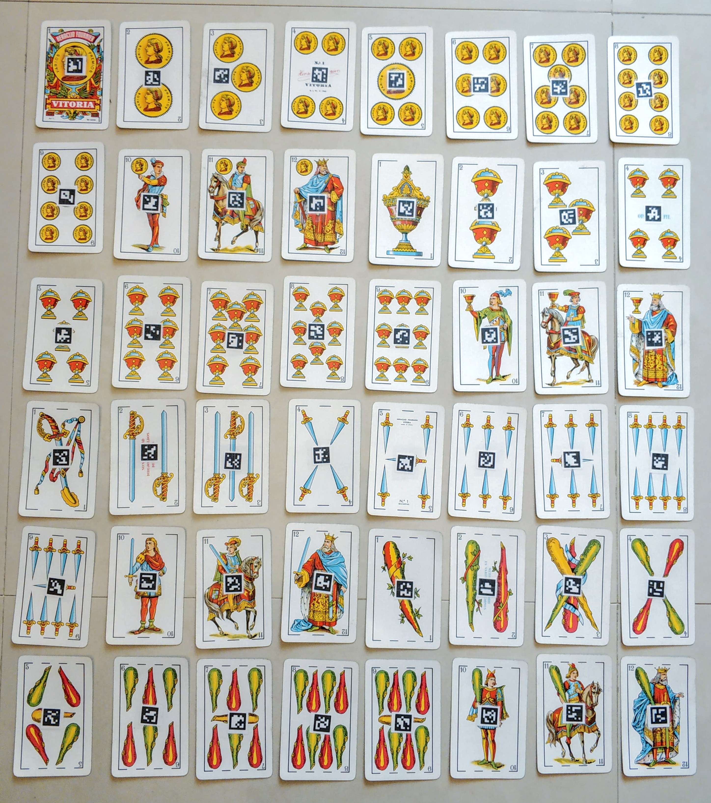

# pyBrisca
**pyBrisca** is a python implementation of the **brisca card game**. 
It have a simple engine, 3 different players, and an Augmented Reality mode
that allows *human* players and *AI* players to play together using *normal* cards.

## Brisca Game Class
Allows you to play brisca using 2 to 4 of these players:
* *Human*: Allows a human player to choose which card to play through a terminal interface.
* *Random*: Picks up a random card from the players hand. 
* *Simple-AI*: Rule based AI that plays much better than random (and some human players too).

## Brisca Game AR
Allows to play a brisca game using *normal* cards with up to 3 other human players. 
Except the game set up, the rest of the humna-machine communication is done by showing the cards
to the computer camera and listenning (or reading) the instruction that the machine gives you.

To set-up a deck to play in AR mode you need to stick the 48 markers in folder */data* to your 
normal brisca deck following this order:
* 1st marker (1st row, 1st column): 1 Oros
* 2nd marker (1st row, 2nd column): 2 Oros
* 2rd marker (1st row, 3rd column): 3 Oros
* ...

Then proceed with **Copes**, **Espases** and finally **Bastos**.
The marker orientation doesn't matter!

See an example of an *official* pyBrisca-AR deck below:

## Installation dependencies
* python3 -m pip install opencv-contrib-python
* sudo apt-get install python3-espeak
* pip3 install pyttsx3

## TODO:
* Complete tests!
* Create a more clever AI player
* Mult language (now it is half english half català)
* Move to Android?
